<picture>
  <source media="(prefers-color-scheme: dark)" srcset="./assets/profile/hero-dark.svg">
  <source media="(prefers-color-scheme: light)" srcset="./assets/profile/hero-light.svg">
  
</picture>

I build interaction-heavy products across voice, geospatial systems, native learning, and AI-assisted interfaces.

[Portfolio ↗](https://miguelalmeida.is-a.dev) *(external — leaves GitHub)* · [LinkedIn ↗](https://www.linkedin.com/in/miguelalmeida1/) *(external — leaves GitHub)*

<picture>
  <source media="(prefers-color-scheme: dark)" srcset="./assets/profile/activity-dark.svg">
  <source media="(prefers-color-scheme: light)" srcset="./assets/profile/activity-light.svg">
  
</picture>

## Selected work

### Second Voice

AI rewriting with explicit provider routing, privacy-aware sharing, abuse protection, and hardened request boundaries.

**Next.js · React · TypeScript · Supabase**

[Code](https://github.com/miguelalmeida0/second-voice) · [Live demo ↗](https://secondvoice-ai.vercel.app/second-voice) *(external — leaves GitHub)*

### Flow

Voice-first personal computing where conversation directly changes calendars, journals, people, and memories.

**TypeScript · React · voice UI · interaction architecture · accessibility**

[Code](https://github.com/miguelalmeida0/flow) · [Live demo ↗](https://miguelalmeida0.github.io/flow/) *(external — leaves GitHub)*

### Leu

Native iPhone study for PDFs with source-linked explanation, active recall, blind spots, and reconstruction.

**Swift · SwiftUI · PDFKit · local-first**

[Code](https://github.com/miguelalmeida0/leu)

### VIGIA

Portugal-first crisis intelligence connecting incidents, facilities, roads, source provenance, and geospatial context.

**PostgreSQL · PostGIS · Node.js · geospatial interfaces**

[Code](https://github.com/miguelalmeida0/vigia-crisis)

## More systems

[Camera Harness](https://github.com/miguelalmeida0/camera-harness) — human-reviewed multimodal suggestions with replayable traces.

[Miguel Design OS](https://github.com/miguelalmeida0/miguel-design-os) — design memory and visual QA for AI-assisted frontend work.

## Engineering signature

**TypeScript · React / Svelte · SwiftUI · Node.js · PostgreSQL / PostGIS · Playwright**

I ship the hard parts after the prototype: interaction state, recovery, accessibility, performance, security boundaries, and end-to-end verification.
